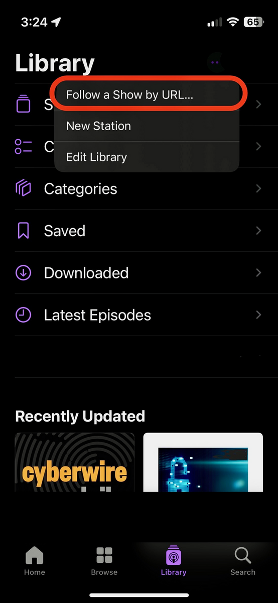
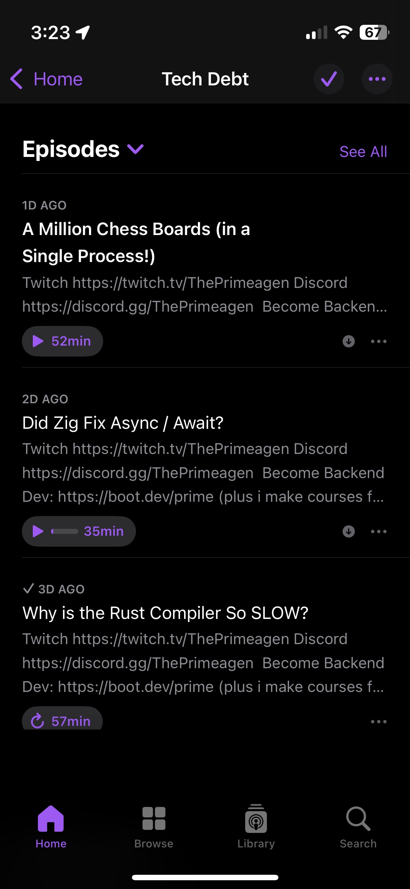
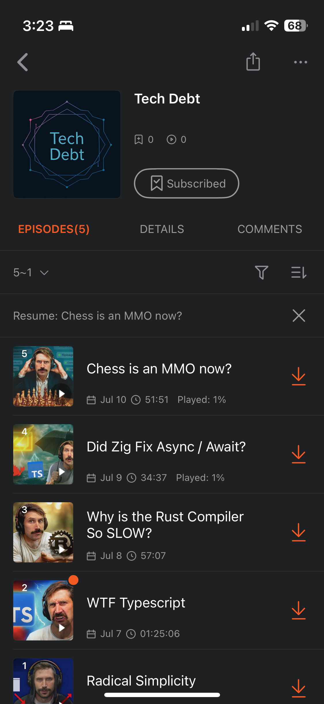

# 🗂️ What is TubeCast
- Converts YouTube channels or videos into personal podcast feeds.
- Lets you follow these feeds in any podcast app (like Apple Podcasts, Castbox, or Pocket Casts) simply by adding the feed URL.
- Uploads everything to the Internet Archive for free, cloud-based hosting.
- Feeds are always up-to-date—new episodes appear in your podcast app whenever you sync.
- Listen on any device, even with your screen off—just like a real podcast.
- Share your feeds easily with friends and family.

<div align="center">
 
</div> 

## 📡 Quick‑Start

The [`tubecast-scripts`](https://drive.google.com/file/d/1F4GIz4UH31PBbM1Uf6F-1snnMB-k3HPj/view?usp=sharing) folder contains everything you need to run **TubeCast**. Each shell script wraps the necessary `docker compose` calls so non‑technical users only have to run a single command per task.

---

### ✨ What’s inside

| File                     | Purpose                                                                                    |
| ------------------------ | -------------------------------------------------------------------------------------------|
| **`example.txt`**       | Template for your secrets (rename to `.env`).                                              |
| **`docker-compose.yml`** | Defines the `tubecast` container + volumes.                                                |
| **`init.sh`**            | One‑time setup: pulls the image, downloads the *ia* CLI, and runs `ia configure`.          |
| **`sync.sh`**            | Runs the regular podcast sync (no extra flags).                                            |
| **`create-show.sh`**     | Creates a new show.                                                                        |
| **`sync-channel.sh`**    | Adds 3 latest videos from a YouTube channel and subscribes to the channel for later sync.  |
| **`add-video.sh`**       | Adds a single YouTube video to a show.                                                     |
| **`remove-video.sh`**    | Removes one video from a show.                                                             |
| **`remove-show.sh`**     | Deletes an entire show.                                                                    |

---

## 🚀 Set-up

> **Note**: You will need to use `terminal` (macOS), `command prompt` or `powershell` (windows) to be able to run them. Open the corresponding app and paste the commands as they are. Best to use `vscode`

Unzip this folder and go into the directory and open terminal
```bash
cd tubecast-scripts
```
### Set-up environment

1. Set the `username`. It is used to create item identifier inside your Internet Archive, where all shows and their data will be hosted.\
Item identifier looks like this: `<username>_tubecast`\
If you want to host your feed on github pages, make sure to use the github username (small letters). It will be used to derive the url to your RSS feed.
2. Set the `home directory`. It is used to fetch your ia configuration (IA-S3 Access key, Secret Key, and cookies). Here's how you can get it:\
- Go to your home directory
```bash
cd ~
```
- Print the home directory on the console
```bash
pwd
```
3. Copy the output and put it on the `HOME_DIR` environment variable inside `.env` file
4. Set the `archive` to `Yes` if you want the feed to be hosted on archive (recommended). By default, it is set to `Yes`.\
Your RSS Feed will look like this: `https://archive.org/download/<username>_tubecast/<show_title>.xml`

    However, if you want otherwise, set it anything else and make sure you have your github username, all in small letters set as the `username` environment variable.\
    Your RSS Feed will look like this: `https://<username>.github.io/<name_of_your_repo>/feed/<show_title>.xml`\
    Even if you host it on archive, you can still use the link to your github page as your feed (after pushing the commit every time, and using `/docs` as your host, of course).

5. Change the filename `example.txt` to `.env`
```bash
cp example.txt .env
```
---

### Initialise the app
Make init.sh executable
```bash
chmod +x init.sh
```
Run the one‑time initializer
```bash
./init.sh
```
Now, you have to configure internet archive. Go to this link `https://archive.org/account/signup` and sign up with **EMAIL and PASSWORD** and verify. Then run the below command on your terminal:
```bash
./ia configure
```
Set up your email and password that you just created your archive account with. The password does not appear on the screen even if you type or paste it for security purposes. Type ENTER after providing your password.

You are now all set!!!
---

## 📜 Script reference

These are commands that you will use to interact with the application. Follow the examples to create your own show.

### 0. Cover Image
1. If you want to add a cover to your show, provide an image in the format `.webp` or `.png` as the show cover. Make sure the the resolution is between `1400 x 1400` and `3000 x 3000` as per the Apple Podcast requirement. You can use the [this tool](https://www.resizepixel.com/) to resize the image.
In order to include a cover image (optional)
2. Inside your `tubecast-scripts` directory there's a folder named `tubecast` and inside that there's another folder named `cover`.
3. The cover image name should follow this format: `cover_<show_title>.png` or `cover_<show_title>.webp`\
So, the path to the cover image will look like this:\
`./tubecast-scripts/tubecast/cover/cover_<show_title>.webp`

### 1. `create-show.sh`

```bash
./create-show.sh --title="Medicine" --description="Medical lectures"
```
It will create a show with the provided `title` and `description`. This is still not ready to use it as a feed for your podcast app. In the subsequent commands, you can use this show by the title.

### 2. `sync-channel.sh`

```bash
./sync-channel.sh --title="Medicine" --channel-id="ThePrimeTimeagen"
```
The show by the `title` will subscribe to the channel and will fetch the latest 3 videos from the channel.\
Upon success, you will see **a link pasted on the console.** \
Now you can add this feed to a podcast app and listen to the audios. Wait a few minutes for it to be available. Internet Archive takes time to update. Convenience costs money :\(
In the subsequent `sync` commands, the show will fetch the latest videos from the channel automatically.
> Note: If you follow the show by the URL on your podcast app once, you don't need to do it everytime you update the url for any of the subsequent commands on this show, just like how you'd expect!
### 3. `add-video.sh`

```bash
./add-video.sh --title="Medicine" --description="The Real Show" --video-url="https://youtu.be/xvFZjo5PgG0?si=-BV8fIKLdQDzdBJO"
```
You are required to provide the `video-url` of the video you wish to add to the show by the `title`. If the show does not exist, this command will create one, with the provided `description`.

### 4. `remove-video.sh`

```bash
./remove-video.sh --title="Medicine" --video-url="https://youtu.be/xvFZjo5PgG0?si=-BV8fIKLdQDzdBJO"
```
You are required to provide the `video-url` of the video you wish to remove from the show by the `title`.

### 5. `sync.sh`
For all of your shows, it fetches latest 3 videos from the channels you are subscribed to.
```bash
./sync.sh
```

### 6. `remove-show.sh`

```bash
./remove-show.sh --title="Medicine"
```
It deletes the show completely, along with the archive data.

---

## 🔧 Troubleshooting

| Symptom                     | Fix                                                                      |
| --------------------------- | ------------------------------------------------------------------------ |
| `docker: command not found` | Install Docker Desktop (Mac/Win) or Docker Engine (Linux).               |
| `ia: command not found`     | Rerun `./init.sh` or make sure `ia` binary is in this folder.            |

---

## 📄 License