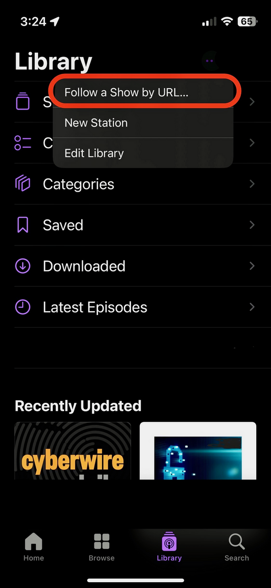
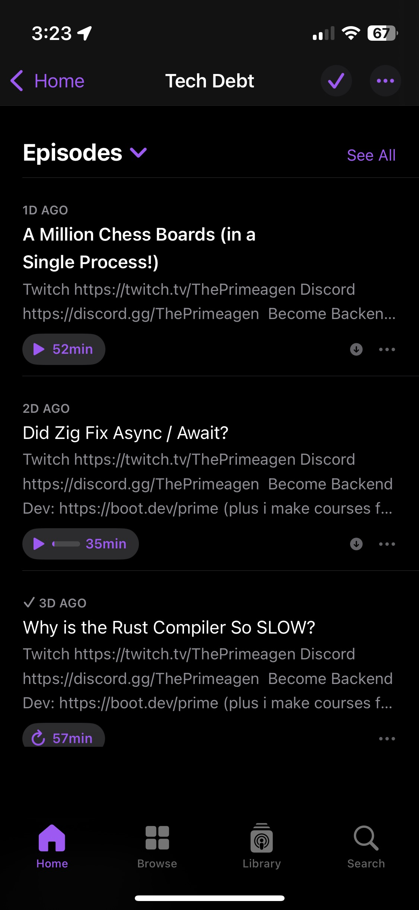
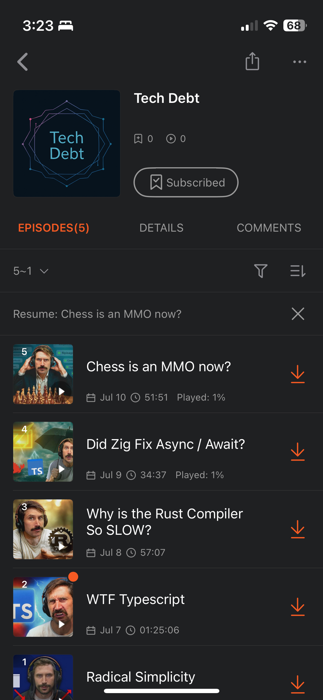

# 🗂️ What is TubeCast
- Converts YouTube channels or videos into personal podcast feeds.
- Lets you follow these feeds in any podcast app (like Apple Podcasts, Castbox, or Pocket Casts) simply by adding the feed URL.
- Uploads everything to the Internet Archive for free, cloud-based hosting.
- Feeds are always up-to-date—new episodes appear in your podcast app whenever you sync.
- Listen on any device, even with your screen off—just like a real podcast.
- Share your feeds easily with friends and family.

## Demo
- Paste this show link on your podcast app: `https://archive.org/download/fitrahhaque_tubecast/bloop.xml`
- You will find it in `Shows` (for Apple Podcasts) list if it does not appear right away.

<div align="center">
  <video src="https://github.com/user-attachments/assets/6c2f3290-b444-4375-b250-e7e9f84b63b4" width="600" controls></video>
</div>

<div align="center">
 
</div> 

## Quick Start

The [`tubecast-scripts`](https://drive.google.com/file/d/1aAkkPFOyZulgHiwneI6GSi2wiICHdFd7/view?usp=sharing) package runs TubeCast in Docker and opens an interactive terminal user interface (TUI). All show management is done from this interface.

### Requirements

- Docker Desktop on macOS or Windows, or Docker Engine with Compose on Linux.
- An [Internet Archive account](https://archive.org/account/signup).
- A terminal. On Windows, use WSL or another Bash-compatible terminal for the included `.sh` scripts.

### Package Contents

| File | Purpose |
| --- | --- |
| `example.txt` | Environment template. Copy it to `.env`. |
| `docker-compose.yml` | Container, storage, and Internet Archive configuration mounts. |
| `init.sh` | Pulls the image, downloads the Internet Archive CLI, and makes the scripts executable. |
| `run.sh` | Updates the image when possible and starts the TubeCast TUI. |
| `tubecast/cover/` | Put show cover images here before creating a show. |

### First-Time Setup

Unzip the package and enter its directory:

```bash
cd tubecast-scripts
```

Create your environment file:

```bash
cp example.txt .env
```

Open `.env` and set a unique username:

```dotenv
USERNAME="yourname"
ARCHIVE="Yes"
```

The username becomes part of your Internet Archive item name: `yourname_tubecast`. Use lowercase letters without spaces.

### Choose Where Feeds Are Hosted

`ARCHIVE="Yes"` is the recommended setting. TubeCast uploads the feed, audio, cover, and episode thumbnails to Internet Archive.

An Internet Archive feed URL looks like this:

```text
https://archive.org/download/<username>_tubecast/<show_title>.xml
```

Spaces in the show title are replaced with underscores in the XML filename.

To host the XML feed through GitHub Pages instead, set `ARCHIVE` to anything other than `Yes`. TubeCast then writes feeds to `docs/feed/`, using this URL format:

```text
https://<github_username>.github.io/TubeCast/feed/<show_title>.xml
```

For GitHub Pages hosting:

1. Set `USERNAME` to your lowercase GitHub username.
2. Push the generated `docs/feed/` files to a GitHub repository named `TubeCast`.
3. In the repository settings, configure GitHub Pages to publish from the `/docs` folder.
4. Push the updated feed files after every TubeCast update.

Audio and artwork still require Internet Archive hosting, so Internet Archive configuration is needed in both modes.

Run the one-time initializer with Bash. It makes `run.sh` executable automatically:

```bash
bash init.sh
```

Configure the Internet Archive CLI using your verified account:

```bash
./ia configure
```

Sign up using an email address and password, then verify the account before running this command. Enter the same email and password when prompted. Your password is not displayed while you type or paste it; press Enter after typing it.

The resulting configuration is stored at `~/.config/internetarchive/ia.ini` and mounted into the TubeCast container automatically. Do not share this file because it contains credentials for your Internet Archive account.

### Prepare Cover Artwork

Place cover files inside the package's `tubecast/cover/` directory before creating a show:

```text
tubecast-scripts/
└── tubecast/
    └── cover/
        └── cover_Medicine.png
```

Cover requirements:

- Use `.png` or `.webp`.
- Use a square image.
- Use dimensions between 1400x1400 and 3000x3000 pixels to meet Apple Podcasts artwork requirements.
- A descriptive filename such as `cover_<show_title>.png` or `cover_<show_title>.webp` is recommended.
- The filename may contain spaces, but you must enter it exactly the same way in the TUI.

If needed, an image resizing tool such as [ResizePixel](https://www.resizepixel.com/) can prepare the artwork before you place it in the folder.

Example filenames:

```text
cover_Medicine.png
cover_Tech Debt.webp
```

TubeCast copies and normalizes the selected image to the show's internal cover filename. Keep the source file in `tubecast/cover/` so it remains available to the Docker container.

### Start TubeCast

```bash
./run.sh
```

The first launch may take a moment while Docker downloads the image.

## TUI Tutorial

### Keyboard Controls

| Key | Action |
| --- | --- |
| `Up` / `Down` | Move through menu items and form fields. |
| `Enter` | Open the selected item, press a button, or confirm an action. |
| `Tab` | Move between form fields and buttons. |
| `Esc` | Return to the main menu from a form. |
| `b` | Go back from a list that shows a Back option. |
| `q` | Quit from the main menu. |

The main menu also shows shortcuts: `v` for shows, `c` to create a show, `s` to subscribe, `a` to sync, `i` to add episodes, `d` to delete a show, and `q` to quit.

For the Docker package, change `USERNAME` or `ARCHIVE` by editing the host `.env` file and restarting TubeCast. The TUI's **set env** screen is intended for native runs and does not persist after a temporary Docker container exits.

### 1. Create a Show

Prepare the cover image using the instructions above before opening the TUI.

Example:

```text
tubecast/cover/cover_Medicine.png
```

In the TUI:

1. Select **create a show**.
2. Enter the show title, for example `Medicine`.
3. Enter a description.
4. Enter the cover filename only, for example `cover_Medicine.png`. Do not enter `tubecast/cover/` in the field.
5. Select **save**.
6. Select **COPY SHOW LINK** to copy the podcast feed URL.

Use the exact same show title in later actions. Show titles are case-sensitive.

### 2. Subscribe to a YouTube Channel

Subscribing adds the latest three videos from a channel and remembers the channel for future syncs.

1. Select **subscribe**.
2. Enter an existing show title.
3. Enter the YouTube channel handle, such as `ThePrimeTimeagen` or `@ThePrimeTimeagen`.
4. Select **Add** and wait for the downloads and uploads to finish.
5. Copy the show link from the success message.

Internet Archive may need a few minutes before newly uploaded audio, artwork, and feeds become available. Podcast applications may also cache the previous feed for a while.

### 3. Add Individual Episodes

1. Select **add episodes**.
2. Enter an existing show title.
3. Enter one or more YouTube video URLs. Separate multiple URLs with commas.
4. Select **Add** and wait for processing to finish.

Example input:

```text
https://youtu.be/video1,https://youtu.be/video2
```

TubeCast downloads the audio and thumbnail, uploads them to Internet Archive, and updates the podcast feed.

### 4. Sync Subscribed Channels

Select **sync** from the main menu. TubeCast checks every channel subscribed to by every show and adds new videos from each channel's latest three results. Videos already in a show are skipped.

### 5. Browse Shows and Copy a Feed URL

1. Select **shows**.
2. Select a show to view its episodes.
3. Select **Copy link to clipboard** to copy the feed URL.
4. Use your podcast app's **Follow a Show by URL** or equivalent option and paste the URL.

You only need to follow the URL once. Future syncs update the same feed.

### 6. Remove an Episode

1. Open **shows** and select a show.
2. Select the episode you want to remove.
3. Choose **YES** in the confirmation dialog.

This removes the episode files from Internet Archive and updates the feed.

### 7. Delete a Show

Select **delete a show**, then select the show to delete.

**Warning:** selecting a show in this menu starts deletion immediately. It removes the local show data and its files from Internet Archive.

### Stop TubeCast

Select **quit** or press `q` from the main menu. Docker removes the temporary container, while your shows, feeds, and cover files remain in the `tubecast-scripts` directory.

## Troubleshooting

| Symptom | Fix |
| --- | --- |
| `docker: command not found` | Install and start Docker Desktop, or install Docker Engine and Compose. |
| Internet Archive configuration not found | Run `./ia configure` and confirm `~/.config/internetarchive/ia.ini` exists. |
| YouTube format or signature errors | Run `docker compose pull` to download the latest TubeCast image. |
| Permission denied when running `run.sh` | Run `bash init.sh` once to restore the script permissions. |
| A show is not visible in a podcast app yet | Wait a few minutes for Internet Archive and the podcast app to refresh their caches. |

---

## 📄 License
